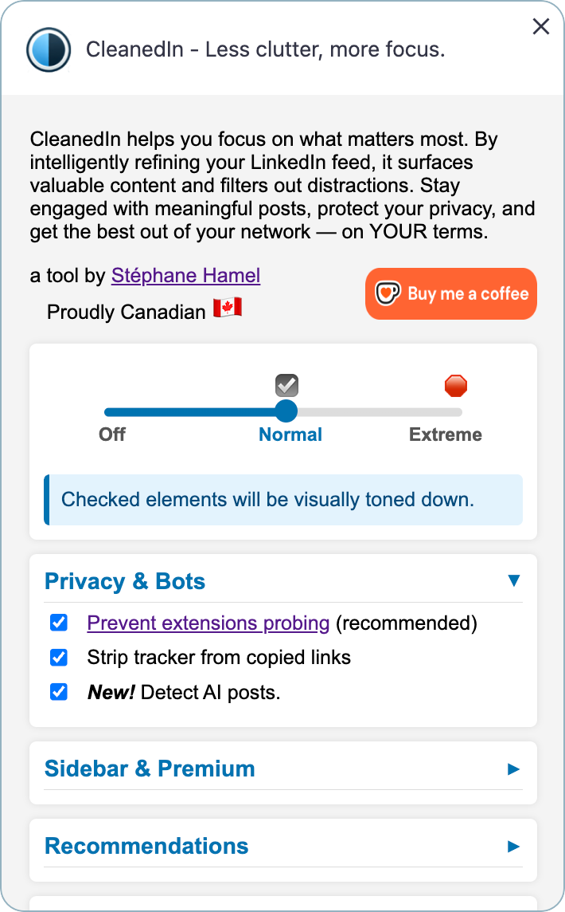

# CleanedIn

**CleanedIn** helps you focus on what matters. By intelligently refining your LinkedIn feed, it highlights valuable insights while reducing distractions. Stay engaged with meaningful posts and protect your privacy. Get the best out of your network — on YOUR terms.

---

## ✨ Features

- Filter AI-generated posts (experimental)
- Privacy: prevent LinkedIn from probing for the presence of other extensions
- Privacy: strip tracking parameters from shared links
- Master switch: turn off, visually tone down the noise, or hide it completely
- Content filtering based on advanced rules (Premium, ads, news, games, suggestions, celebrations, etc.)
- Highlight posts based on your own custom regex, using a color of your choice (unlimited number of rules)
- Badge showing the "noise ratio" in your feed
- Changing options immediately reflects in LinkedIn opened tabs without reloading
- Clean, unobtrusive design

---

## 💾 Installation
Works in Chrome and Brave (recommended).

Get it directly from the [Chrome Web Store](https://chromewebstore.google.com/detail/cleanedin-less-clutter-mo/cnificnjkdipoboaofmfkdnefmieihpf) and get updates automatically.

Development install:
- on Github, click on the "<> Code" button and "Download ZIP", then unzip in a folder of your choice.
- or do "npm install cleanedin" in a folder of your choice.

1. Type chrome://extensions in the Chrome URL bar and press enter.
1. Enable developer mode using the toggle on the right
1. Click Load Unpacked on the left side of the screen.
1. Navigate to the location of the folder you unzipped, and select it.

---

## 🚫 License &amp; Disclaimer
This project is **source-available** but **not open source**.

You may:
- View and inspect the code

You may **not**:
- Modify or create derivative works
- Reuse any part of the code in other projects or products
- Use it for commercial purposes

See [`LICENSE`](./LICENSE) for details.

### Disclaimer

This project is provided **as-is**, without any warranties or guarantees of any kind, express or implied.

The code is shared **for educational and experimental purposes only**. Use it at your own risk.

### ⚠️ Important Notice

This extension may modify how LinkedIn content is presented or behaves in your browser. Such modifications might:

- Be considered a violation of LinkedIn’s Terms of Service or Community Guidelines
- Interfere with LinkedIn's intended user experience or functionality
- Result in account restrictions or enforcement actions by LinkedIn

By using this code, you accept full responsibility for any consequences, including any impact on your LinkedIn account.

The author **does not endorse** or encourage the violation of any service's terms, including those of LinkedIn.

---

## 🙋 Contributing

Contributions are welcome under strict terms.

By submitting a pull request, you agree that:
- Your code is original
- You grant the project owner a non-exclusive, worldwide, royalty-free license to use and modify your contribution
- Your contributions may be used in the CleanedIn project only

Steps to contribute:
1. Fork the repo
2. Create a feature branch
3. Submit a pull request with a clear explanation

👉 [Sponsor this project, buy me a coffee!](ko-fi.com/shamel)

---

## 📫 Contact

Questions? Licensing inquiries?  
Email: `shamel67@gmail.com`

---

**Made with ❤️ in Canada 🇨🇦.**
